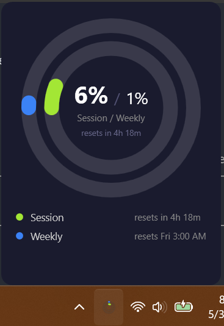
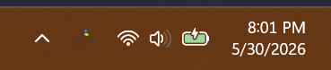

# ClaudeUsageTray

A Windows system tray app that shows your [Claude.ai](https://claude.ai) Pro plan usage at a glance.



The tray icon gives a at-a-glance color-coded indicator:



## What it does

- Displays a tray icon with two color-coded bars representing your current session (5-hour) and weekly (7-day) utilization
- Hover the icon for a tooltip with exact percentages
- Click the icon for a popup with more detail and reset times
- Polls every 2 minutes automatically

## Requirements

- Windows 10/11
- [.NET 10 Runtime](https://dotnet.microsoft.com/download/dotnet/10.0)
- [WebView2 Runtime](https://developer.microsoft.com/microsoft-edge/webview2/) (included with modern Windows / Edge)
- A Claude.ai Pro account

## Building

```
dotnet build
```

To publish a self-contained release build:

```
dotnet publish -p:PublishProfile=win-x64
```

Output goes to `installer/publish/`.

## How it works

Claude.ai doesn't expose a public API for usage data. This app uses a hidden WebView2 browser to authenticate with claude.ai using your normal session cookies, then queries the internal usage API (`/api/organizations/{id}/usage`) that the web UI itself uses. Your credentials never leave your machine — the session is stored in the local WebView2 profile under `%LocalAppData%\ClaudeUsageTray\WebView2`.

Settings (your organization ID) are stored in `%AppData%\ClaudeUsageTray\settings.json`.
